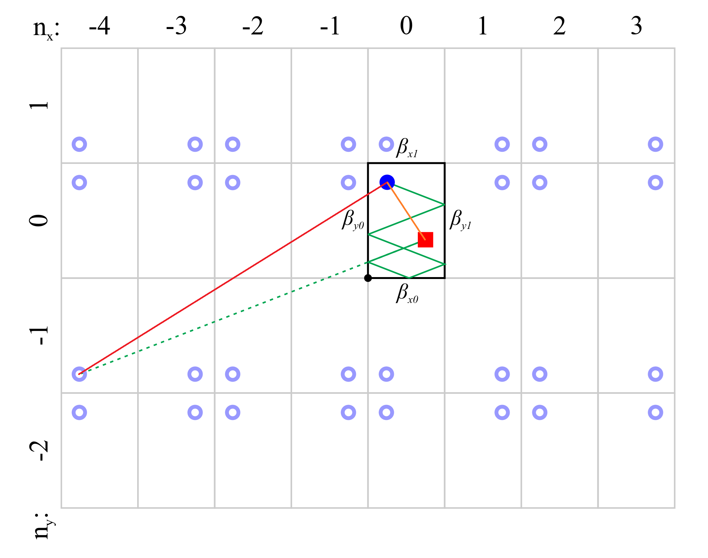

# ISM

## Schematic Diagram

  

## Analysis

### The Principle

只有一个轴向的平行壁面时，每当两个方向的$\texttt{\footnotesize\red{声线}}$遇到壁面反射一次再到达自身 $\tiny{（即声源自己观测自己的信息）}$，等效于将声线从声源处沿着初始传播的方向拉直，然后外延到的点位就是镜像声源的位置。也就是$\texttt{\footnotesize\blue{反射后再到达声源}}$这个过程等效于$\texttt{\footnotesize\blue{从外延到的点位直接到达声源}}$。

有二个轴向的平行壁面时，就等效于从声源发出的所有平面 $\footnotesize 0∼360°$ 声线中，将那些恰好能回到声源的声线从声源处沿着初始传播方向拉直，拉直后外延到的点位就是镜像声源的位置。

当有三个轴向的平行壁面时，就等效于从声源发出的所有平面 $\footnotesize 0 ∼ 360°$ 以及仰角 $\footnotesize 0 ∼ 180°$ 的所有声线中, 将那些恰好能回到声源的声线从声源处沿着初始传播方向拉直，拉直后外延到的点位就是镜像声源的位置。

综上，镜像声源其实是反射过程的等效，而不是真的有这么多声源。加入原始声压信号的时空表达式为 $s(t,\bm r)$, 则每一个反射等效而来的镜像声源到达原始声源处的信号都相当于 $s(t,\bm r)$ 卷积了一个具有时间漂移的时空狄拉克函数 $δ(t-\frac{|\bm d|}{c},\bm r)$ ，其中 $|\bm d|$ 为镜像声源到以原始声源处为观测点位的距离，而 $c$ 为声速。

如果观测点位从声源处挪了 $Δ \bm r$ , 则相当于 $s(t,\bm r)$ 卷积了一个带空间漂移的时空狄拉克函数 $δ(t,\bm r + Δ \bm r)$ 。如此，$\texttt{\footnotesize\blue{从声源处出发的所有声线中恰好能到达观测点的拉直声线}}$  $\blue {{\bm l}_{s′→o}}$ 等效于$\texttt{\footnotesize\blue{从声源处出发的所有声线中恰好能到达声源处的拉直声线}}$ $\blue {{\bm l}_{s′→s}}$ $\texttt{\footnotesize\blue{漂移}}$ $\blue {Δ \bm r}$，即 ${\bm l}_{s′→o}={\bm l}_{s′→s} + {Δ \bm r}$ .

<!-- A Python Library for Room Impulse Response Simulation with GPU Acceleration -->

  

由于一维波动方程中有项

$$
{\rm e}^{j[wt-k(r+Δr)]}
={\rm e}^{jw[t-\frac{(r+Δr)}{c}]}
={\rm e}^{jw[(t-\frac{Δr}{c})-\frac{r}{c}]}
$$

即空间移动导致的相移将等效于时间漂移导致的相移，也即

$$s(t,\bm r) ⊛ δ(t,\bm r + Δ \bm r) \ ⟺ \ s(t,\bm r) ⊛ δ(t-\frac{|Δ \bm r|}{c},\bm r)$$

因此从镜像源到原始声源再叠加空间漂移等效为从镜像源直接到漂移点，也即

$$δ(t,\bm r + {\bm l}_{s′→s})⊛δ(t,\bm r + {\bm l}_{s→o}) = δ(t,\bm r + {\bm l}_{s′o}) = δ(t-\frac{|{\bm l}_{s′o}|}{c},\bm r)$$

### Formula

所有镜像源的相移效果，等效于如下方程

$$
h(t) = ∑_{i=-N_x}^{N_x} ∑_{j=-N_y}^{N_y} ∑_{k=-N_z}^{N_z} \frac{β_{ijk}}{d_{ijk}}  \ δ(t-\frac{d_{ijk}}{c})
$$

若是所有墙面系数一致，则与碰撞次数也即镜像次数 $n=|i|+|j|+|k|$ 有关的系数就是 $β_{ijk} = β^n$
